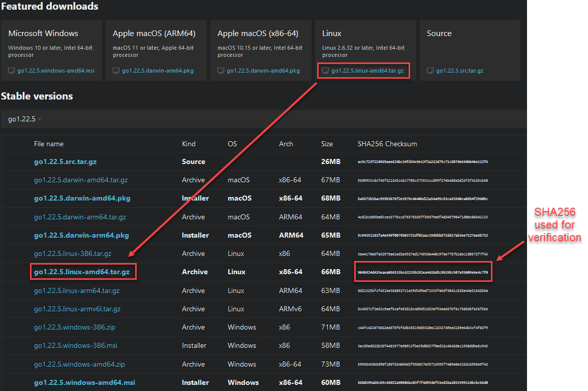

# How To Install and Configure Go on Ubuntu 22.04.4 LTS

Google developed [Go](https://golang.org/) out of a need for a programming language that is uncomplicated, compiles quickly, and runs efficiently in production. Addtionally, while Go is a versatile, general-purpose language, it’s particularly well-suited for programs using networking or distributed systems, earning it a reputation as "the language of the cloud”. Go also simplifies formatting, by making the format of your code part of the language specification, and it streamlines deployment by compiling to a single binary. Learning Go is straightforward, with a small set of keywords, making it a good choice for beginners and experienced developers alike.

This tutorial guides you through installing and configuring a programming workspace with Go via the command line in an for Ubuntu 22.04.4 LTS  environment, but the principles described here apply to other Debian Linux distributions.

## Prerequisites

You will need a computer or virtual machine with Ubuntu 22.04.4 LTS installed, admin access to the machine, and an internet connection. You can download this operating system via the [Ubuntu 22.04.4 LTS release page](http://releases.ubuntu.com/jammy). Additionally, this tutorial assumes you are comfortable using Ubuntu at the command line. For more information about the Linux command line, see the [Introduction to the Linux Terminal](https://www.digitalocean.com/community/tutorials/an-introduction-to-the-linux-terminal) tutorial. 


## Download and Verify Installation File

To download and verify the Go installation file, do the following:

1. Navigate to your home (`~`) directory:

    ```bash
    cd ~
    ```

1. Copy the URL of the current binary tarball file from the [official Go downloads page](https://golang.org/dl/), and note the SHA256 hash listed next to it. You’ll use this hash to [verify the downloaded file](https://www.digitalocean.com/community/tutorials/how-to-verify-downloaded-files).

    
    


1. Instead of using `sudo apt install` to install Go, use `curl` to retrieve the tarball from the URL you copied, which allows you to configure Go:

    ```bash
    curl -LO https://go.dev/dl/go1.22.5.linux-amd64.tar.gz 
    ```

    Using `-L0` is the equivalent of invoking both the `-L` option, which allows the server to complete the request if there is a URL redirect,  and the `-O` option, which writes the target (`go1.22.5.linux-amd64.tar.gz`) to a file of the same name in the directory (`~`) in which the `curl` command is run. In other words, this command creates the file `~/go1.22.5.linux-amd64.tar.gz`. As the command runs, the command line updates to show the status of the tarball downloading. When the download completes, the command line prompt reappears:

    ```bash
    Output
      % Total    % Received % Xferd  Average Speed   Time    Time     Time  Current
                                     Dload  Upload   Total   Spent    Left  Speed
    100    75  100    75    0     0    398      0 --:--:-- --:--:-- --:--:--   401
    100 65.7M  100 65.7M    0     0  2989k      0  0:00:22  0:00:22 --:--:-- 3281k
    ```

1. Verify the download using `sha256sum`:

    ```bash
    sha256sum go1.22.5.linux-amd64.tar.gz
    ```
    The hash that is displayed from running this command should match the hash that was on the downloads page. If it does not, the file may have been corrupted, and you should download the file again.

    ```bash
    Output
    904b924d435eaea086515bc63235b192ea441bd8c9b198c507e85009e6e4c7f0  go1.22.5.linux-amd64.tar.gz
    ```

## Extract the Tarball File

The tarball file is an archive file that contains other files and directories. After downloading it, extract and install its contents to your desired location. We recommend installation in `/usr/local`, which you can do by following these steps: 

1. Verify that Go is not yet  installed in `/usr/local`:

    ```bash
    ls /usr/local
    ```

   `ls` lists the contents of the directory supplied as an argument, `/usr/local`:

    ```bash
    Output
    aws-cli  etc    include  man   share
    bin      games  lib      sbin  src
    ```

    Since a `go` directory does not appear in the output, Go is not installed yet at this location. 
 

1. Use `tar` to extract the file from your home directory to `/usr/local`. 

    ```bash
    sudo tar -xz -f go1.22.5.linux-amd64.tar.gz -C /usr/local  
    ```

    `sudo` is the Ubuntu command that invokes admin privileges, which you need, since you are writing to a protected location that contains system files. `tar` is the utility that handles archive files, including ones that end in `tar.gz`. The `-xz` options indicate that `tar` should extract the file (`-x`) using the `gzip` algorithm (`-z`). The `-f` option indicates that we will be supplying the filename, `go1.22.5.linux-amd64.tar.gz`. Finally, `-C` indicates the target directory in wich to extract the file, `/usr/local`. (The `tar` command is a multi-purpose utility that accepts [numerous sub-commands and options](https://www.howtogeek.com/248780/how-to-compress-and-extract-files-using-the-tar-command-on-linux).)

1. If the system asks for your admin password, enter it:

    ```bash
    [sudo] password for user: 
    ```

1. Check that the file was installed successfully in `/usr/local` by listing that directory's contents:

    ```bash
    ls /usr/local
    ```

    If the installation succeeded, the output of `ls` now shows the `go` directory:

    ```bash
    Output
    aws-cli  etc    go       lib  sbin   src
    bin      games  include  man  share
    ```

1. If the installation succeeded, delete the tarball file by running:

    ```bash
    rm ~/go1.22.5.linux-amd64.tar.gz 
    ```

    The tarball is an installation file that is no longer needed after a successful installation.

## Create your Workspace

Now that you have installed Go, you can create your workspace and download your first package. This section first describes the workspace and then provides instructions on creating it and verifying that it is set up correctly.

### Understanding the Workspace

When you program in Go, you'll use a directory workspace that contains the following primary directories:

* `bin`: This directory contains executables built and installed by the Go tools. Executables are binary program files that run on a system. These files are the output of a Go compiler and are the end product of a Go program, since an executable file allows you to use your code to perform the tasks it was designed to do.
* `pkg` This directory contains packages that you have downloaded. These packages contain Go files that you can use in your projects so that you do not have to re-create this functionality.
* `src`: This directory contains files you have authored in Go. The Go compiler uses these files to create an executable binary file. 

When importing packages into the `pkg` subdirectory, the import process often creates a version-controlled directory that allows you and the developers of the packages to keep track of changes to the packages as they evolve over time through further development. Two typical names of such directories are `github.com` and `golang.org`, but you may see other names, as well. If you are using a version control system like [Git](https://git-scm.com/) in conjunction with [Github](https://www.github.com), you may also choose to put your own your source files under a directory named `github.com`, though you are free to choose another directory name. You can find out more about version control systems by viewing the official pages of [Git](https://git-scm.com/), [Mercurial](https://www.mercurial-scm.org/), and [Bazaar](https://launchpad.net/bzr). 

Besides the main `bin`, `pkg`, and `src` directories, there may be many subdirectories and files within these, as shown in the following example, which is a typical Go workspace:

```bash
.
├── bin                                              # executables
│   ├── buffalo                                      
│   ├── dlv                                          
│   └── packr                              
├── pkg                                              # package downloads
│   ├── mod
│   │   ├── cache
│   │   │   └── download
│   │   │       ├── github.com
│   │   │       │   └── digitalocean
│   │   │       │       └── godo
│   │   │       │           └── @v
│   │   │       │               ├── list
│   │   │       │               ├── v1.118.0.info
│   │   │       │               ├── v1.118.0.lock
│   │   │       │               ├── v1.118.0.mod
│   │   │       │               ├── v1.118.0.zip
│   │   │       │               └── v1.118.0.ziphash
│   │   │       └── sumdb
│   │   │           └── sum.golang.org
│   │   │               └── lookup
│   │   │                   └── github.com
│   │   │                       └── digitalocean
│   │   │                           └── godo@v1.118.0
│   │   └── github.com
│   │       └── digitalocean
│   │           └── godo@v1.118.0
│   │               ├── 1-click.go
│   │               ├── 1-click_test.go
│   │               ├── CHANGELOG.md
│   │               ├── CONTRIBUTING.md
│   │               ├── LICENSE.txt
│   │               ├── README.md
│   │               ├── account.go
│   │               ├── account_test.go
│   │               ├── action.go
│   │               ├── action_test.go
│   │               ├── apps.gen.go
│   │               ├── apps.go
│   │               ├── apps_accessors.go
│   │               ├── apps_accessors_test.go
│   │               ├── apps_test.go
│   │               ├── balance.go
│   │               ├── balance_test.go
│   │               ├── billing_history.go
│   │               ├── billing_history_test.go
│   │               ├── cdn.go
│   │               ├── cdn_test.go
│   │               ├── certificates.go
│   │               ├── certificates_test.go
│   │               ├── databases.go
│   │               ├── databases_test.go
│   │               ├── doc.go
│   │               ├── domains.go
│   │               ├── domains_test.go
│   └── sumdb
│       └── sum.golang.org
│           └── latest
└── src                                              # source files   
    └── github.com
        └── digitalocean
            └── godo
                ├── .git                             # Git repository metadata
                ├── account.go                       # source file
                ├── account_test.go                  # source test file
                ├── ...
                ├── timestamp.go
                ├── timestamp_test.go
                └── util
                    ├── droplet.go
                    └── droplet_test.go
```

### Create `bin` and `src`
 
Now you will create a programming workspace that contains the `src` and `bin` directories. We recommend creating these directories directly under `~/go`, either by using the compact command `mkdir -p ~/go{bin,src}` or by issuing the equivalent in several commands, as follows: 

```bash
cd ~
mkdir go
cd go
mkdir bin  
mkdir src
```

The first line, `cd ~`, changes the directory to your home directory. The `mkdir go` command creates a `go` directory there, and `cd go` navigates you to that directory. The last two `mkdir` commands then create two directories, `bin` and `src`, under that location, which results in the following directory structure:

```
└── $HOME       
    └── go
        ├── bin
        └── src
```

Notice that the home directory in this diagram is not labeled `~`, but instead as `$HOME`. This is an environment variable, which we'll explain in the next section.

## Set Environment Variables

When compiling your Go programs, you could type in full paths for the Go compiler and other files, but it's more convenient, as well as standard practice to use environment variables. Environment variables store full paths that can be referenced with the variable name, which becomes a shorthand.

As an example, the `$PATH` variable is an environment variable that your operating system uses to look for executable files and scripts when it can't find those files in the directory in which a command is run. When you run the Go compiler, you issue the command `go run`. Without an environment variable, you would have to run `/usr/local/go/bin/go run`. After setting up a few environment variables (including `$PATH`), you can type `go run`, instead.

There are several ways of setting the necessary environment variables, but we recommend setting them by editing your `.bashrc` file. If you are using a shell other than `bash`, such as `zsh`, edit the corresponding file (for example, `.zshrc`). Set the environment variables by doing the following:

1. Open the `.bashrc` file, which is located in your home directory, using nano:

    ```bash
    nano ~/.bashrc
    ```

1. Scroll to the bottom of the file and enter the following, beginning on a new line:

    ```bash
    export GOPATH="$HOME/go"
    export USERBINARIES="$GOPATH/bin"
    export GOBINARYPATH="/usr/local/go/bin"
    export PATH="$PATH:$GOPATH:$USERBINARIES:$GOBINARYPATH"
    ``` 
    These four new lines at the end of your `.bashrc` file create three new environment variables and update the `$PATH` environment variable to include the paths stored in the three environment variables, since these are the paths that Go uses. `GOPATH="$HOME/go"`, creates the first environment variable, `$GOPATH`, which is set to `$HOME/go`. This allows third party tools that look for `GOPATH` to know where your workspace is so files can be automatically put there. Note that in setting `$GOPATH`, we have used another environment variable, `$HOME` and added `/go` to the end of that path. (At the command line, when you type `cd ~`, this is equivalent to typing `cd $HOME`. When setting environment variables, we cannot use the `~` shorthand.)

    The next environment variable, `USERBINARIES`, is created by taking the value of `$GOPATH` and appending `/bin` to the end of that path, resulting in `$USERBINARIES` being set to `$HOME/go/bin`. When Go compiles and installs tools, it puts them in this directory.

    The third new environment variable created is `GOBINARYPATH`, which is the path to the Go binary that you installed using `tar`. Finally, to allow you, Go, and third-party tools to run all Go programs from anywhere on your system, the final line of the file updates `$PATH` by appending the values of each of the three new environment variables to the existing value of `$PATH`.

1. Save the edited `.bashrc` by entering `CTRL+O` and then pressing `Enter`, when prompted.

1. After `nano` confirms that the file has been written to, exit `nano` by entering `CTRL+X`.

1. To update your shell so that it can use the three new environment variables as well as the updated value of `$PATH`, run:

    ```bash
    source ~/.bashrc
    ```

    This instructs Ubuntu to reload `~/.bashrc` so the new environment variables and the updated `$PATH` are now accessible to the OS.

1. Verify that `$PATH` has been updated, by running:

    ```bash
    echo $PATH
    ```

    This command writes the  value of `$PATH` to the terminal. Typically, the output is fairly long, but the end of it should now contain the three new paths for the workspace and the Go executable.

    ```bash
    Output
    . 
    .
    .   
    /home/test-user/go:/home/test-user/go/bin:/usr/local/go/bin
     ```

    If you are logged in as `root`, you would see `/root/go/bin` in the path.

1. Verify that the environment variables are working correctly by checking the current version of Go:
    ```bash
    go version
    ```
    
    You should receive output similar to the following, if the installation and environment variables are set correctly:

    ```bash
    Output
    go version go1.22.5 linux/amd64
    ```

### Download a Package and Create `pkg`

Now that you have installed and configured Go, create the final of the three main directories, `pkg`, by downloading a package:

1. Download and install the latest version of the DigitalOcean `Godo` package by running:

    ```bash
    go install github.com/digitalocean/godo@latest
    ```

    `Godo` is a Go client library for accessing the DigitalOcean V2 API (application programming interface). Your system may or may not issue a warning, but the output should be similar to the following:

    ```bash
    Output
    go: downloading github.com/digitalocean/godo v1.118.0
    go: github.com/digitalocean/godo@latest (in github.com/digitalocean/godo@v1.118.0):
    The go.mod file for the module providing named packages contains one or more replace directives. It must not contain directives that would cause it to be interpreted differently than if it were the main module.
    ```

1. Verify that `go install` installed `Godo` and created the directory structure by running:

    ```bash
    cd ~/go
    ls -lR1  
    ```
    
    The `-lR1` options for `ls` configure it to list files in long form (`l`), listing recursively down into nested directories (`R`), with one file or directory listed per line (`1`). If the installation was successful, `ls -lR1` generates a substantial amount of output, only a small portion of which is shown below:

    ```bash
    Output
    .
    .
    .
    /home/test-user/go/pkg/mod/github.com/digitalocean/godo@v1.118.0:
    total 1384
    -r--r--r-- 1 test-user test-user  2435 Jul  8 23:09 1-click.go
    -r--r--r-- 1 test-user test-user  1408 Jul  8 23:09 1-click_test.go
    -r--r--r-- 1 test-user test-user 23279 Jul  8 23:09 CHANGELOG.md
    -r--r--r-- 1 test-user test-user  2716 Jul  8 23:09 CONTRIBUTING.md
    -r--r--r-- 1 test-user test-user  2694 Jul  8 23:09 LICENSE.txt
    -r--r--r-- 1 test-user test-user  5712 Jul  8 23:09 README.md
    -r--r--r-- 1 test-user test-user  1898 Jul  8 23:09 account.go
    -r--r--r-- 1 test-user test-user  4021 Jul  8 23:09 account_test.go
    -r--r--r-- 1 test-user test-user  2598 Jul  8 23:09 action.go    
    .
    .
    .
    ``` 

    **Note:** There are other methods of seeing this output. To limit the output to entries that contain `digitalocean` in them, run `ls -lr1 ~/go | grep digitalocean.` If you wish to see all of the output but in a graphical format, you can use the `tree` command if it is installed on your system, by running `tree ~/go`. If `tree` is not installed, you can install it using `sudo apt install tree`.

## Create and Run a Program

Now that you have created your Go workspace, test it by creating and running a short program:

1. Navigate to `~/go/src`.

    ```bash
    cd ~/go/src
    ``` 
    
2. Use `nano` or another text editor to create a new file named `hello.go`.

    ```bash
    nano hello.go
    ```

3. When `nano` opens, enter the following in the file:

    ```go
    package main
    import "fmt"

    func main() {
        fmt.Println("Hello, World!")
    }   
    ```

    In Go, every file belongs to a package. Since `hello.go` is not called by another package (which would make it a library), the file is a standalone package, which always begins with `package main` as its first line. The next line imports the `fmt` library. (Standalone packages are not called by other packages but *can* import libraries, which contain additional functionality.) Importing `fmt` allows `hello.go` to use the functionality in that library instead of requiring the developer to author that functionality all over again. The `fmt` library contains formatting functions, including `Println`, which prints text to the terminal. 

    When `hello.go` runs, the operating system calls the `main` function first, which appears next in the file. This function, in turn, calls the `Println` function from the imported `fmt` package to print the string `Hello, World!` to the terminal. There is no more code in the file, so program execution completes at that point, and the system returns to the command prompt.

1. Save the file by entering `CTRL+O` and then pressing `Enter`, when prompted.

1. After `nano` confirms that the file has been written to, exit `nano` by entering `CTRL+X`.

1. Run `hello.go`:

    ```
    go run hello.go
    ```

    The terminal produces the following output:

    ```bash
    Output
    Hello, World!
    ```

    If your system produces this output, your Go installation is complete and working.
